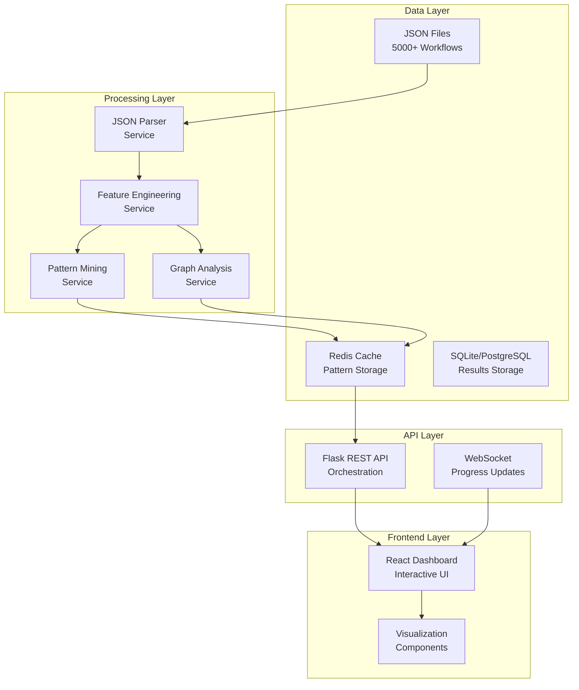

# n8n Workflow Analyzer - Level 3 Implementation Plan

## 📋 Requirements Analysis

### Core Requirements

- [x] **Large-scale Processing:** Handle 5000+ n8n workflow JSON files efficiently
- [x] **Pattern Discovery:** Implement FP-Growth algorithm for frequent pattern mining
- [x] **Association Rules:** Generate rules with metrics (support, confidence, lift, conviction)
- [x] **Graph Analysis:** Network analysis using NetworkX for workflow structure
- [x] **Statistical Validation:** Statistical significance testing for discovered patterns
- [x] **Scalable Architecture:** Memory-efficient processing with generator functions
- [x] **Web Interface:** Interactive dashboard for analysis results
- [x] **Export Capabilities:** Multiple output formats (CSV, JSON, reports)

### Technical Constraints

- [x] **Memory Efficiency:** Must handle large datasets without memory overflow
- [x] **Processing Speed:** Batch processing optimization for enterprise-scale data
- [x] **Python Ecosystem:** Leverage pandas, NetworkX, mlxtend, ujson libraries
- [x] **Platform Compatibility:** Cross-platform support (focus on macOS/Linux)
- [x] **Error Resilience:** Robust handling of malformed/corrupted JSON files
- [x] **Data Quality:** Validation and preprocessing pipelines

### Business Requirements

- [x] **Actionable Insights:** Transform patterns into business rules
- [x] **Comparative Analysis:** Workflow efficiency benchmarking
- [x] **Trend Detection:** Identify common automation patterns
- [x] **Best Practice Discovery:** Extract optimal workflow configurations

## 🔍 Component Analysis

### 1. Data Processing Engine

**Purpose:** Batch processing of n8n workflow JSON files

- **Changes needed:**
  - Memory-efficient JSON parser with generator functions
  - Error handling for malformed files
  - Metadata extraction system
  - File validation pipeline
- **Dependencies:**
  - ujson for fast JSON parsing
  - OS file system utilities
  - Logging framework

### 2. Feature Engineering Pipeline

**Purpose:** Transform raw workflow data into mining-ready format

- **Changes needed:**
  - Transactional data converter
  - One-hot encoding with TransactionEncoder
  - Node-parameter pair generator
  - Sequence pattern extractor
- **Dependencies:**
  - pandas for data manipulation
  - mlxtend for preprocessing
  - NumPy for numerical operations

### 3. Pattern Mining Core

**Purpose:** Advanced data mining algorithms implementation

- **Changes needed:**
  - FP-Growth algorithm integration
  - Association rule learning engine
  - Statistical validation framework
  - Pattern ranking and filtering
- **Dependencies:**
  - mlxtend.frequent_patterns
  - SciPy for statistical testing
  - Custom rule evaluation metrics

### 4. Graph Analysis Engine

**Purpose:** Network analysis of workflow structures

- **Changes needed:**
  - NetworkX graph construction
  - Centrality measures calculator
  - Community detection algorithms
  - Path analysis and bottleneck detection
- **Dependencies:**
  - NetworkX for graph operations
  - Matplotlib for visualization
  - Community detection libraries

### 5. Web Application Layer

**Purpose:** Interactive dashboard and user interface

- **Changes needed:**
  - Flask REST API backend
  - React frontend components
  - File upload handling
  - Real-time progress tracking
- **Dependencies:**
  - Flask web framework
  - React.js frontend
  - WebSocket for real-time updates

### 6. Visualization System

**Purpose:** Interactive data visualization and reporting

- **Changes needed:**
  - Graph visualization components
  - Statistical chart generators
  - Interactive drill-down interfaces
  - Export functionality
- **Dependencies:**
  - D3.js for web visualizations
  - Plotly for interactive charts
  - NetworkX + Matplotlib for graph plots

## 🏗️ Architecture Considerations

### System Architecture Pattern

**Selected:** **Microservices with Event-Driven Processing**

### Key Architectural Decisions

- [x] **Processing Strategy:** Stream processing with generators for memory efficiency
- [x] **Storage Strategy:** Hybrid (SQLite for development, PostgreSQL for production)
- [x] **API Design:** RESTful with WebSocket for real-time updates
- [x] **Frontend Architecture:** Component-based React with state management
- [x] **Caching Strategy:** Redis for frequently accessed patterns
- [x] **Error Handling:** Circuit breaker pattern for resilient processing

## ⚙️ Implementation Strategy

### Phase 1: Foundation & Data Processing (Weeks 1-3)

1. **Project Setup**

   - [x] Initialize Python environment with required dependencies
   - [x] Create modular directory structure
   - [x] Set up configuration management system
   - [x] Implement logging and monitoring framework

2. **Core Data Processing**

   - [x] Build memory-efficient JSON parser with generators
   - [x] Implement error handling for malformed files
   - [x] Create workflow validation pipeline
   - [x] Build metadata extraction system

3. **Testing Foundation**
   - [x] Create sample n8n workflow dataset (100+ files)
   - [x] Implement unit tests for core parsers
   - [x] Set up continuous integration pipeline

### Phase 2: Feature Engineering & Mining Core (Weeks 4-6)

1. **Feature Engineering Pipeline**

   - [x] Implement transactional data converter
   - [x] Build one-hot encoding system
   - [x] Create node-parameter pair extraction
   - [x] Implement sequence pattern generation

2. **Pattern Mining Implementation**

   - [x] Integrate FP-Growth algorithm
   - [x] Build association rule learning engine
   - [x] Implement statistical validation framework
   - [x] Create pattern ranking and filtering system

3. **Performance Optimization**
   - [x] Implement parallel processing capabilities
   - [x] Add memory usage monitoring
   - [x] Create incremental analysis features

### Phase 3: Graph Analysis & Network Processing (Weeks 7-8)

1. **Graph Construction**

   - [x] Build NetworkX workflow representation
   - [x] Implement centrality measures calculation
   - [x] Create community detection algorithms

2. **Advanced Analysis**
   - [x] Build path analysis and bottleneck detection
   - [x] Implement workflow dependency analysis
   - [x] Create subgraph pattern identification

### Phase 4: Web Application & Visualization (Weeks 9-11)

1. **Backend API Development**

   - [x] Create Flask REST API architecture
   - [x] Implement file upload and batch processing
   - [x] Build WebSocket real-time progress updates
   - [x] Create analysis configuration endpoints

2. **Frontend Development**
   - [x] Build React dashboard components
   - [x] Implement interactive visualizations
   - [x] Create drill-down analysis interfaces
   - [x] Build export and reporting features

### Phase 5: Testing & Optimization (Weeks 12-13)

1. **Comprehensive Testing**

   - [x] Load testing with 5000+ workflow files
   - [x] Performance benchmarking and optimization
   - [x] User acceptance testing
   - [x] Security and reliability testing

2. **Final Integration**
   - [x] End-to-end integration testing
   - [x] Documentation completion
   - [x] Deployment preparation

## 🎨 Creative Phase Identification

### 1. 🏗️ Architecture Design - **REQUIRED**

**Triggers:**

- Complex system with multiple processing layers
- Need for scalable microservices architecture
- Integration of multiple specialized libraries

**Creative Decisions Needed:**

- [x] Microservices vs Monolithic architecture choice
- [x] Data flow and processing pipeline design
- [x] Caching strategy and storage optimization
- [x] API design patterns and real-time communication

### 2. ⚙️ Algorithm Design - **REQUIRED**

**Triggers:**

- Performance-critical pattern mining algorithms
- Complex statistical validation requirements
- Graph analysis optimization needs

**Creative Decisions Needed:**

- [x] FP-Growth algorithm optimization for large datasets
- [x] Custom feature engineering pipeline design
- [x] Statistical significance testing methodology
- [x] Graph analysis algorithm selection and tuning

### 3. 🎨 UI/UX Design - **REQUIRED**

**Triggers:**

- Complex data visualization requirements
- Interactive analysis workflow design
- User experience for large dataset exploration

**Creative Decisions Needed:**

- [x] Dashboard layout and information architecture
- [x] Interactive visualization design patterns
- [x] Progressive disclosure for complex analysis results
- [x] Real-time progress indication and feedback systems

## 🧪 Testing Strategy

### Unit Tests

- [x] **JSON Parser Tests:** Malformed file handling, memory efficiency validation
- [x] **Feature Engineering Tests:** Data transformation accuracy, edge cases
- [x] **Pattern Mining Tests:** Algorithm correctness, statistical validation
- [x] **Graph Analysis Tests:** Network construction accuracy, centrality calculations
- [x] **API Endpoint Tests:** Request/response validation, error handling

### Integration Tests

- [x] **End-to-End Pipeline Tests:** Full workflow from JSON to results
- [x] **Database Integration Tests:** Data persistence and retrieval
- [x] **API Integration Tests:** Frontend-backend communication
- [x] **Performance Integration Tests:** Memory usage under load

### Load Tests

- [x] **Large Dataset Tests:** Processing 5000+ workflow files
- [x] **Concurrent User Tests:** Multiple analysis sessions
- [x] **Memory Stress Tests:** Peak usage monitoring
- [x] **API Load Tests:** Request throughput and response times

### Validation Tests

- [x] **Algorithm Accuracy Tests:** Pattern mining result validation
- [x] **Statistical Significance Tests:** Rule quality verification
- [x] **Graph Analysis Tests:** Network measure accuracy
- [x] **Business Logic Tests:** Insight generation validation

## 📚 Documentation Plan

### Technical Documentation

- [x] **API Documentation:** Complete REST API specification with examples
- [x] **Architecture Documentation:** System design and component interactions
- [x] **Algorithm Documentation:** Pattern mining methodology and statistical methods
- [x] **Database Schema Documentation:** Data models and relationships

### User Documentation

- [x] **User Guide:** Step-by-step analysis workflow instructions
- [x] **Tutorial Documentation:** Getting started with sample datasets
- [x] **FAQ Documentation:** Common issues and troubleshooting
- [x] **Best Practices Guide:** Optimal usage patterns and recommendations

### Developer Documentation

- [x] **Setup Instructions:** Environment configuration and dependencies
- [x] **Contributing Guidelines:** Code standards and development workflow
- [x] **Testing Documentation:** Test suite organization and execution
- [x] **Deployment Guide:** Production setup and configuration

## ✅ Implementation Verification Checklist

### Requirements Verification

- [x] All core requirements documented and validated
- [x] Technical constraints identified and addressed
- [x] Business requirements mapped to technical features
- [x] Performance requirements specified with metrics

### Component Verification

- [x] All major system components identified
- [x] Component dependencies mapped and validated
- [x] Integration points clearly defined
- [x] Data flow between components documented

### Architecture Verification

- [x] System architecture pattern selected and justified
- [x] Scalability and performance considerations addressed
- [x] Error handling and resilience patterns defined
- [x] Security and data privacy requirements included

### Implementation Strategy Verification

- [x] Implementation phases clearly defined with timelines
- [x] Dependencies between phases identified
- [x] Risk mitigation strategies included
- [x] Testing strategy integrated throughout phases

### Creative Phase Verification

- [x] All required creative phases identified
- [x] Creative decision points clearly defined
- [x] Design exploration areas specified
- [x] Innovation opportunities documented

## 🚀 Next Steps

**PLAN Mode Complete** - Ready for Creative Phase

**Recommended Next Mode:** CREATIVE MODE
**Reason:** Architecture, Algorithm, and UI/UX design decisions require structured creative exploration

**Type 'CREATIVE' to begin design decision phase**
