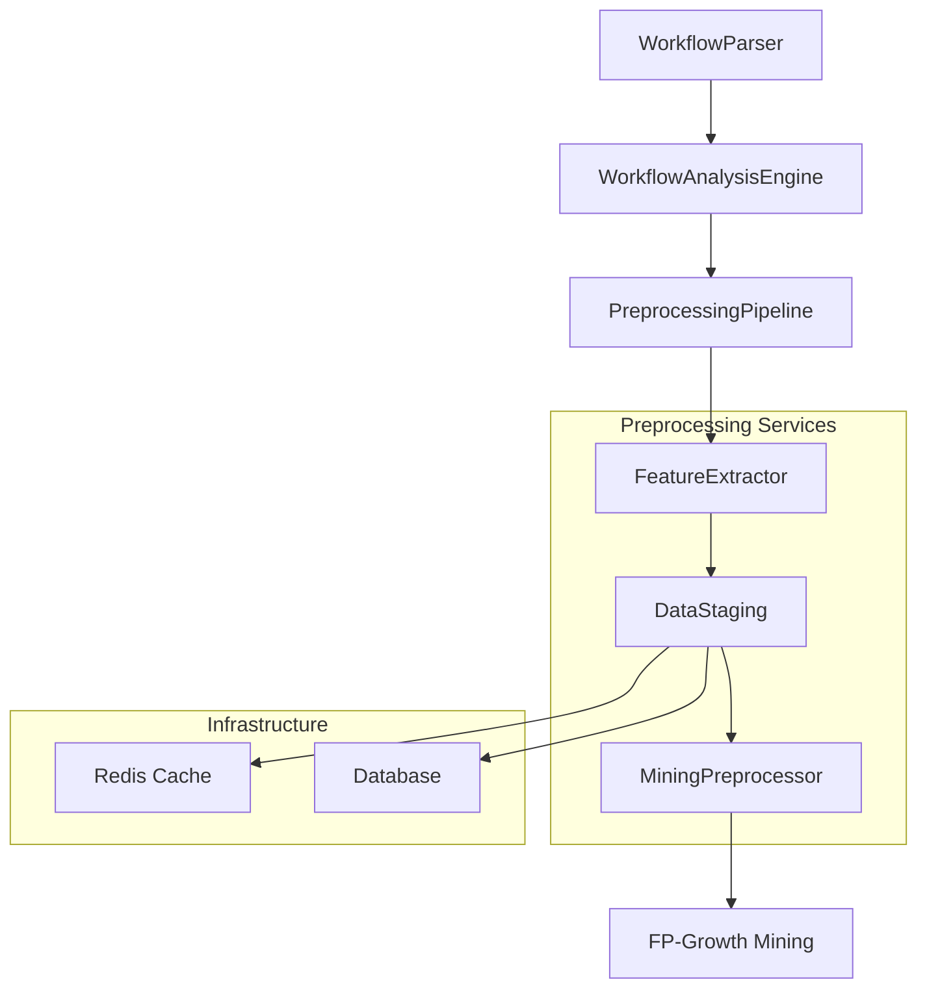

# Phase 3 Creative Design Decisions

## Data Preprocessing and Feature Engineering

**Project:** nabi-workflow-analyzer  
**Phase:** Phase 3 - Data Preprocessing and Feature Engineering  
**Date:** December 20, 2024  
**Creative Phases:** Architecture Design + Algorithm Design

---

## 🏗️ ARCHITECTURE DESIGN DECISIONS

### Selected Architecture: Hybrid Service-Generator Architecture

**Decision Rationale:**

- Combines modular service design with memory-efficient generator processing
- Aligns with existing Phase 2 architecture patterns
- Supports 5000+ workflow processing requirements
- Enables independent testing and development of components

### Architecture Components

#### 1. PreprocessingPipeline (Coordinator)

```python
class PreprocessingPipeline:
    """
    Main orchestrator for preprocessing workflow data
    Uses dependency injection for service composition
    Provides generator-based processing for memory efficiency
    """
    def preprocess_workflows(self, workflows: Generator[N8nWorkflow, None, None]) -> Generator[ProcessedWorkflow, None, None]:
        # Generator-based pipeline orchestration
```

#### 2. FeatureExtractor (Service)

```python
class FeatureExtractor:
    """
    Multi-level feature extraction service
    - Node-level: type, parameters, complexity
    - Connection-level: patterns, sequences
    - Workflow-level: structure, quality metrics
    """
```

#### 3. DataStaging (Service)

```python
class DataStaging:
    """
    Efficient intermediate data storage and retrieval
    Memory-optimized for large dataset processing
    Supports batch operations
    """
```

#### 4. MiningPreprocessor (Service)

```python
class MiningPreprocessor:
    """
    Converts features to FP-Growth transactional format
    Handles statistical preprocessing
    Optimizes data structures for mining algorithms
    """
```

### Architecture Benefits

- **Modularity**: Clear separation of concerns
- **Testability**: Independent component testing
- **Performance**: Generator-based memory efficiency
- **Integration**: Natural fit with existing WorkflowAnalysisEngine
- **Scalability**: Designed for enterprise-scale processing

---

## ⚙️ ALGORITHM DESIGN DECISIONS

### Selected Strategy: Hybrid Adaptive Algorithm Approach

**Decision Rationale:**

- Balances implementation complexity with pattern quality
- Provides extensible foundation for future optimization
- Enables early validation with real workflow data
- Maintains good performance characteristics

### Algorithm Components

#### 1. Multi-Level Feature Extraction

**Node-Level Features:**

```python
def extract_node_features(self, node: N8nNode) -> Dict[str, Any]:
    return {
        'type': node.type,
        'param_count': len(node.parameters),
        'complexity': self._calculate_node_complexity(node),
        'position_zone': self._get_position_zone(node.position)
    }
```

**Connection-Level Features:**

```python
def extract_connection_patterns(self, workflow: N8nWorkflow) -> List[str]:
    """
    Extract patterns:
    - Sequential: A→B→C
    - Fan-out: A→{B,C,D}
    - Fan-in: {A,B,C}→D
    """
```

**Workflow-Level Features:**

```python
def extract_workflow_features(self, workflow: N8nWorkflow) -> Dict[str, Any]:
    return {
        'node_count': len(workflow.nodes),
        'density': self._calculate_density(workflow),
        'max_depth': self._calculate_max_depth(workflow),
        'quality_score': self._assess_quality(workflow)
    }
```

#### 2. Transaction Format Design

**Transaction Items Format:**

- `"type:NodeType"` (e.g., "type:Webhook")
- `"pattern:A→B"` (e.g., "pattern:Webhook→Set")
- `"complexity:Level"` (e.g., "complexity:High")
- `"quality:Score"` (e.g., "quality:High")

#### 3. Optimized FP-Growth Pipeline

```python
class OptimizedMiningPipeline:
    def mine_patterns(self, transactions: List[List[str]]) -> PatternResults:
        """
        Enhanced FP-Growth with workflow-specific optimizations:
        1. Quality-based transaction filtering
        2. Adaptive support thresholds
        3. Workflow-specific pattern validation
        """
```

#### 4. Statistical Validation Framework

```python
class PatternValidator:
    def validate_pattern_significance(self, pattern: AssociationRule) -> ValidationResult:
        """
        Multi-metric validation:
        - Chi-square test for independence
        - Lift significance testing
        - Conviction threshold validation
        """
```

### Algorithm Benefits

- **Quality**: Multi-level features capture workflow semantics
- **Performance**: Optimized for large dataset processing
- **Validation**: Statistical significance testing
- **Extensibility**: Designed for future algorithm enhancements

---

## 🔄 INTEGRATION STRATEGY

### WorkflowAnalysisEngine Integration

```python
class WorkflowAnalysisEngine:
    def preprocess_for_pattern_mining(self, workflows, **kwargs):
        """
        New preprocessing method added to existing engine
        Seamless integration with Phase 2 capabilities
        """
        pipeline = PreprocessingPipeline(
            feature_extractor=FeatureExtractor(),
            data_staging=DataStaging(),
            mining_preprocessor=MiningPreprocessor()
        )
        return pipeline.preprocess_workflows(workflows)
```

### Data Flow Architecture



---

## 📊 PERFORMANCE CHARACTERISTICS

### Memory Efficiency

- **Generator Processing**: Lazy evaluation throughout pipeline
- **Batch Processing**: Configurable batch sizes for memory control
- **Caching Strategy**: Intelligent feature caching for repeated analysis

### Scalability Targets

- **Dataset Size**: 5000+ workflows
- **Processing Time**: < 30 minutes for full preprocessing
- **Memory Usage**: < 4GB peak memory consumption
- **Throughput**: 50+ workflows per minute

### Quality Metrics

- **Feature Coverage**: Multi-level feature extraction
- **Pattern Quality**: Statistical validation with significance testing
- **Integration Quality**: Seamless integration with existing components

---

## 🎯 IMPLEMENTATION ROADMAP

### Phase 3.1: Core Infrastructure (Days 1-2)

- Implement PreprocessingPipeline coordinator class
- Create service interfaces and dependency injection
- Set up generator-based processing foundation

### Phase 3.2: Feature Extraction (Days 3-4)

- Implement FeatureExtractor with multi-level extraction
- Create transaction conversion algorithms
- Add feature caching and optimization

### Phase 3.3: Data Staging and Mining (Days 5-6)

- Implement DataStaging with efficient storage
- Create MiningPreprocessor for FP-Growth format
- Add statistical validation framework

### Phase 3.4: Integration and Testing (Days 6-7)

- Integrate with WorkflowAnalysisEngine
- Comprehensive testing with sample workflows
- Performance validation with large datasets

---

## ✅ CREATIVE PHASE VERIFICATION

### Architecture Design ✅

- [x] Problem clearly defined
- [x] Multiple options considered (4 options analyzed)
- [x] Pros/cons documented for each option
- [x] Decision made with clear rationale
- [x] Implementation plan included
- [x] Architecture diagram created

### Algorithm Design ✅

- [x] Problem clearly defined
- [x] Multiple options considered (4 options analyzed)
- [x] Pros/cons documented for each option
- [x] Decision made with clear rationale
- [x] Implementation plan included
- [x] Algorithm flow documented

### Documentation ✅

- [x] Creative phase decisions documented
- [x] Implementation roadmap created
- [x] Performance characteristics defined
- [x] Integration strategy specified

---

**CREATIVE PHASES COMPLETE** ✅  
**READY FOR IMPLEMENTATION MODE** 🚀

_Created: December 20, 2024_  
_Next Phase: Implementation of Phase 3 components_
