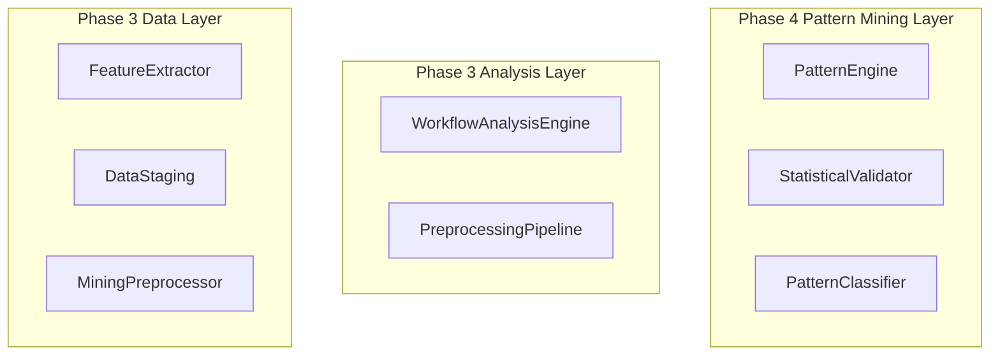

# PHASE 4 CREATIVE DESIGN DECISIONS

**Project:** nabi-workflow-analyzer  
**Phase:** Phase 4 - Pattern Mining and Algorithm Implementation  
**Date:** December 20, 2024  
**Creative Session:** Algorithm Design, Architecture Design, and Visualization Design

---

## 🎯 CREATIVE PHASE OVERVIEW

**Creative Phases Completed:**

- ⚙️ Algorithm Design - Advanced pattern mining algorithms beyond FP-Growth
- 🏗️ Architecture Design - Pattern engine and validation framework integration
- 📊 Data Visualization Design - User interface for pattern exploration

**Objective:** Design comprehensive pattern mining capabilities for n8n workflow analysis with statistical validation and user-friendly exploration interfaces.

---

## ⚙️ ALGORITHM DESIGN DECISIONS

### Selected Approach: Hybrid Adaptive Pattern Mining Architecture

**Context:**

- Need to discover patterns in n8n workflows beyond basic FP-Growth
- Support for 5000+ workflow processing with memory efficiency
- Statistical validation and confidence metrics required
- Integration with existing Phase 3 preprocessing pipeline

**Options Evaluated:**

1. Enhanced FP-Growth with Statistical Extensions
2. Multi-Algorithm Pattern Discovery Engine
3. Graph-Based Pattern Mining with Statistical Clustering
4. Hybrid Adaptive Pattern Mining Architecture ✅ SELECTED

**Decision Rationale:**

- **Comprehensive Discovery:** Addresses all pattern types needed for workflow analysis
- **Adaptive Performance:** Algorithm selection based on data characteristics
- **Future-Proof:** Extensible architecture for additional algorithms
- **Workflow-Specific:** Designed specifically for n8n workflow requirements
- **Statistical Validation:** Built-in confidence metrics and significance testing

**Implementation Strategy:**

- Phase 4.1: Core PatternEngine with enhanced FP-Growth
- Phase 4.2: Add graph-based structural pattern discovery
- Phase 4.3: Implement statistical clustering for pattern classification
- Phase 4.4: Add adaptive algorithm selection logic
- Phase 4.5: Performance optimization and validation

**Technical Components:**

```python
class PatternEngine:
    def __init__(self, config):
        self.fp_growth_engine = EnhancedFPGrowth()
        self.graph_engine = WorkflowGraphAnalyzer()
        self.cluster_engine = StatisticalCluster()
        self.selector = AdaptiveSelector()
```

---

## 🏗️ ARCHITECTURE DESIGN DECISIONS

### Selected Approach: Layered Architecture with Pattern Mining Layer

**Context:**

- Five new components to integrate with existing Phase 3 foundation
- Must maintain Hybrid Service-Generator Architecture principles
- Preserve memory efficiency and generator-based processing
- Seamless integration with WorkflowAnalysisEngine

**Options Evaluated:**

1. Monolithic Pattern Mining Extension
2. Layered Architecture with Pattern Mining Layer ✅ SELECTED
3. Microservice-Style Component Architecture
4. Plugin-Based Pattern Mining Architecture

**Decision Rationale:**

- **Architectural Consistency:** Maintains Phase 3 principles
- **Clear Separation:** Pattern mining layer separated from analysis layer
- **Integration Simplicity:** Builds naturally on existing components
- **Testability:** Independent layer testing capability
- **Performance:** Minimal overhead with maintained modularity

**Architecture Structure:**



**Layer Responsibilities:**

- **Pattern Mining Layer:** Algorithm orchestration, validation, classification
- **Analysis Layer:** Workflow analysis and preprocessing coordination
- **Data Layer:** Feature extraction, staging, and mining preparation

---

## 📊 DATA VISUALIZATION DESIGN DECISIONS

### Selected Approach: Progressive Disclosure Multi-Panel Interface

**Context:**

- Complex pattern data requires intuitive exploration interface
- Users need both overview and detailed analysis capabilities
- Support for pattern comparison and relationship analysis
- Export and sharing functionality required

**Options Evaluated:**

1. Traditional Dashboard with Charts and Tables
2. Interactive Graph-Based Pattern Visualization
3. Progressive Disclosure Multi-Panel Interface ✅ SELECTED
4. Pattern Story Interface with Guided Discovery

**Decision Rationale:**

- **Information Management:** Handles complexity without overwhelming users
- **User Flexibility:** Supports both overview and detailed workflows
- **Scalability:** Panel-based approach scales well
- **Implementation Balance:** Moderate complexity with high UX value
- **Extension Capability:** Framework extensible for future features

**Interface Design:**

- **Overview Panel:** Pattern summary and key metrics
- **Detail Panel:** Individual pattern analysis and visualization
- **Comparison Panel:** Pattern relationships and similarity analysis
- **Export Panel:** Results export and sharing capabilities

**User Experience Flow:**

1. Overview → Pattern summary and discovery
2. Detail → Deep dive into specific patterns
3. Comparison → Pattern relationship analysis
4. Export → Results sharing and reporting

---

## 🔧 IMPLEMENTATION GUIDELINES

### Technical Components to Create

1. **PatternEngine** (`n8n_analyzer/patterns/pattern_engine.py`)

   - Hybrid algorithm coordination
   - Adaptive algorithm selection
   - Statistical validation integration

2. **StatisticalValidator** (`n8n_analyzer/analysis/statistical_validator.py`)

   - Pattern significance testing
   - Confidence metric calculation
   - Quality assessment framework

3. **PatternClassifier** (`n8n_analyzer/patterns/pattern_classifier.py`)

   - Pattern categorization system
   - Similarity analysis algorithms
   - Clustering implementation

4. **PatternRoutes** (`n8n_analyzer/api/pattern_routes.py`)

   - API endpoints for pattern mining
   - Query and filtering capabilities
   - Result serialization

5. **PatternVisualizer** (`n8n_analyzer/visualization/pattern_visualizer.py`)
   - Multi-panel interface implementation
   - Interactive pattern exploration
   - Export and sharing features

### Integration Strategy

- **Data Flow:** WorkflowAnalysisEngine → PatternEngine → StatisticalValidator → PatternClassifier
- **API Integration:** PatternRoutes provides access to pattern mining results
- **Visualization:** PatternVisualizer creates user interfaces for pattern exploration
- **Memory Efficiency:** Maintain generator-based processing throughout

### Performance Considerations

- **Algorithm Selection:** Adaptive selection based on workflow characteristics
- **Memory Management:** Generator-based processing for large datasets
- **Caching Strategy:** Intelligent caching for frequently accessed patterns
- **Parallel Processing:** Support for concurrent pattern mining operations

---

## ✅ CREATIVE PHASE VALIDATION

### Requirements Verification

- **✅ Advanced Pattern Mining:** Hybrid adaptive architecture addresses all pattern types
- **✅ Statistical Validation:** Built-in significance testing and confidence metrics
- **✅ Performance Requirements:** Memory-efficient architecture for 5000+ workflows
- **✅ User Interface:** Progressive disclosure interface for intuitive exploration
- **✅ Integration:** Layered architecture maintains existing system principles

### Design Decision Quality

- **Algorithm Design:** Comprehensive approach balancing performance and discovery capability
- **Architecture Design:** Clear separation of concerns with maintained architectural consistency
- **Visualization Design:** User-centered design with progressive complexity management

### Implementation Readiness

- **Technical Specifications:** Complete component specifications with size estimates
- **Integration Strategy:** Clear integration points with existing system
- **Development Approach:** TDD strategy with real data testing throughout
- **Quality Validation:** Comprehensive testing strategy for all components

---

## 🚀 NEXT STEPS

**Phase 4 Creative Design Complete:** All design decisions documented and validated

**Ready for Implementation Mode:**

- Algorithm implementation with hybrid adaptive approach
- Architecture implementation with layered design
- Visualization implementation with progressive disclosure interface

**Development Sequence:**

1. Phase 4.1: Advanced Pattern Mining Engine
2. Phase 4.2: Statistical Validation Framework
3. Phase 4.3: Pattern Classification and Similarity
4. Phase 4.4: API and Visualization Integration
5. Phase 4.5: Performance Optimization and Integration

**Quality Assurance:**

- TDD approach with test-first development
- Real workflow data testing throughout
- Performance validation with large datasets
- User experience testing for visualization interfaces

---

_Creative decisions documented: December 20, 2024_  
_Ready for: IMPLEMENT MODE - Phase 4 Implementation_
